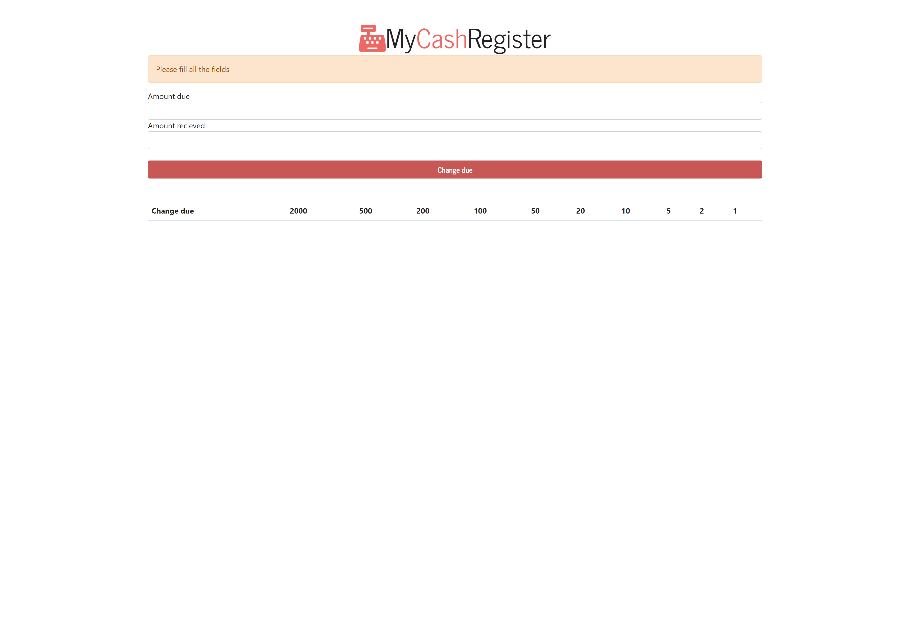
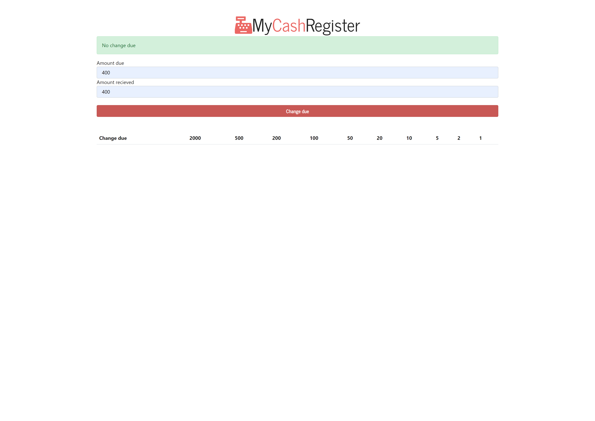
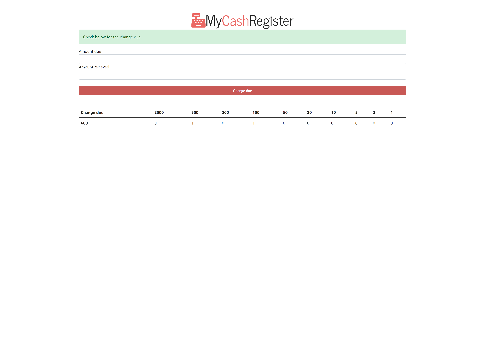

## Table of contents

- [Overview](#overview)
  - [The challenge](#the-challenge)
  - [Screenshot](#screenshot)
  - [Links](#links)
- [My process](#my-process)
  - [Built with](#built-with)
  - [What I learned](#what-i-learned)
- [Author](#author)

## Overview

This is a cash register app built using plain/vanilla JavaScript
### The challenge

Problem Statement
-Your program has currencies of Rs. 1, 5, 10, 20, 100, 500, 2000.
-Your user enters a bill amount say Rs. 243.
-Your user then enters cash given say Rs. 2000.
-Now, help the user by telling how can he/she return the change to the customer with a minimum number of notes?

### Screenshot

### Links

- Solution URL: [https://github.com/NandodkarAmogh/Cash-register-app](https://github.com/NandodkarAmogh/Cash-register-app)
- Live Site URL: [https://jscash-register.netlify.app/](https://jscash-register.netlify.app/)

## My process

### Built with

- Vanilla JavaScript
- HTML
- Bootstrap

### What I learned

Through this project I learnt many concepts like DOM manipulations and object oriented programming.
 
